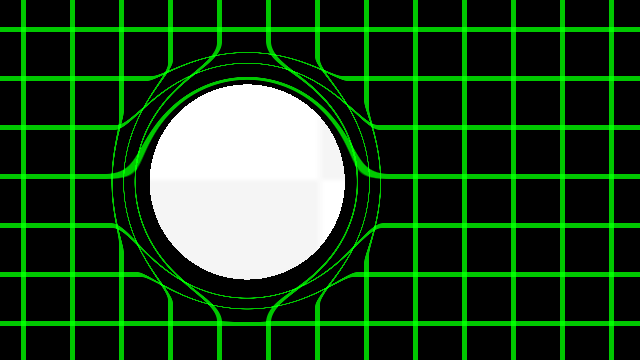

# Unity-Effects 
Unityで作ったエフェクト集です [English](https://translate.google.com/translate?sl=ja&tl=en&u=https://github.com/setchi/Unity-Effects) (by Google Translate)

## Portal
ポータルのように画面を歪めるポストプロセスエフェクトです。位置・半径のパラメータを持っており、スクリプトから制御できます。マウスの位置に追従して動くサンプルになっています。ポータルの内側には別のテクスチャを描画できます。

[http://setchi.hatenablog.com/entry/2017/12/29/193857](http://setchi.hatenablog.com/entry/2017/12/29/193857)

## Environment
Unity 2017.3.0f3

## LICENSE
MIT
